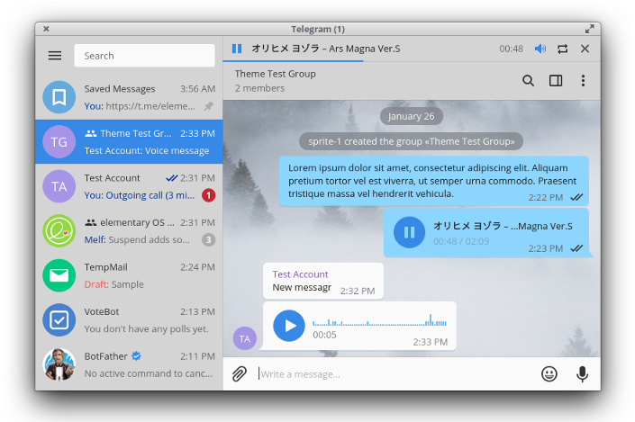

# elementaryOS theme for Telegram

## Why?

Telegram is made in Qt and uses its own theme instead of relying on the system. This will make it fit better with the elementaryOS design. For more information, [you can read the write-up](https://medium.com/@sprite_1ww/making-telegram-fit-the-elementary-os-design-7f6986a1fa44).

## How?

Download the theme and apply it. This requires the latest Telegram client so make sure it is not version 1.7.x.

Download link: http://sprite-1.github.io/elementary/theme/telegram/sprite-1_elementary_v1.1.tdesktop-theme

---
[elementary-patches](https://github.com/sprite-1/elementary-patches)