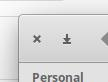
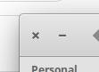

# Change the minimize button icon to not look like a download icon

 

## Why?

Some people who enabled the minimize button in elementaryOS are not fond of how the icon looks.

## How?

Open the Terminal and enter the following commands.

`wget https://sprite-1.github.io/elementary/symbolic/window-minimize-symbolic.svg`

`sudo mv /usr/share/icons/elementary/actions/symbolic/window-minimize-symbolic.svg /usr/share/icons/elementary/actions/symbolic/window-minimize-symbolic.svg.bak`

`sudo mv window-minimize-symbolic.svg /usr/share/icons/elementary/actions/symbolic/window-minimize-symbolic.svg`

`sudo chown -R root:root /usr/share/icons/elementary/actions/symbolic/window-minimize-symbolic.svg`

Reboot afterwards to reflect the changes.

---
[elementary-patches](https://github.com/sprite-1/elementary-patches)