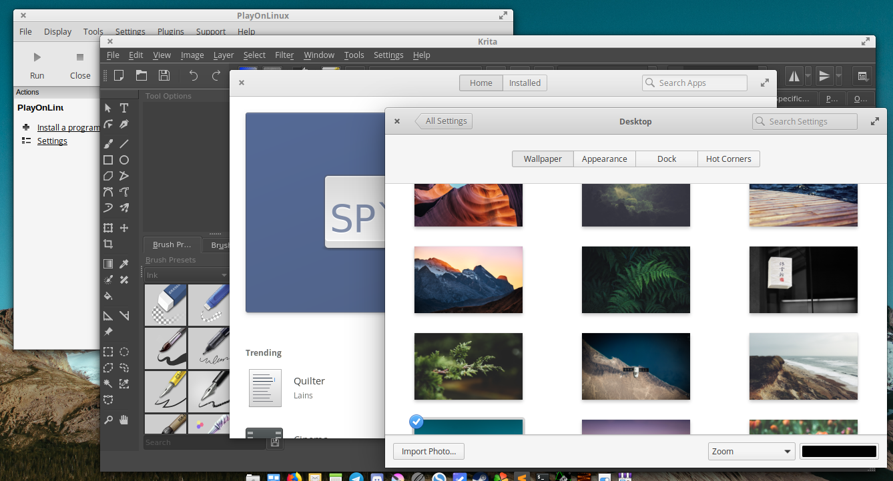

# Smaller titlebar height for non-GTK applications

## Why?

On smaller screens, every space is valuable. For non-GTK apps, the titlebar contains nothing more than the close button, maximize button and the name of the app. This shouldn't eat up too much vertical space compared to GTK apps' headerbars that actually host additional functions and buttons.

## How?

Edit `/usr/share/themes/elementary/gtk-3.0/apps.css` and paste the block of code below at the bottom of the file.

> __NEWBIE TIP:__ You need root permission to edit this file. So open up the Terminal and paste the following:  
`sudo io.elementary.code /usr/share/themes/elementary/gtk-3.0/apps.css`  
Enter your user password once you're asked for it. This will open an elevated instance of Code so you can make your changes properly.

	/* shrink headerbars */
	headerbar {
		min-height: 0px;
		padding-left: 2px;
		padding-right: 2px;
	}

	headerbar entry,
	headerbar spinbutton,
	headerbar button,
	headerbar separator {
		margin-top: 0px;
		margin-bottom: 0px;
	}

	/* shrink ssd titlebars */
	.default-decoration {
		min-height: 0;
		padding: 0px;
	}

	.default-decoration .titlebutton {
		min-height: 0px;
		min-width: 0px;
	}

	window.ssd headerbar.titlebar {
		padding-top: 0px;
		padding-bottom: 0px;
		min-height: 0;
	}

	window.ssd headerbar.titlebar button.titlebutton {
		padding-top: 0px;
		padding-bottom: 0px;
		min-height: 0;
	}

[elementary-patches](https://github.com/sprite-1/elementary-patches)